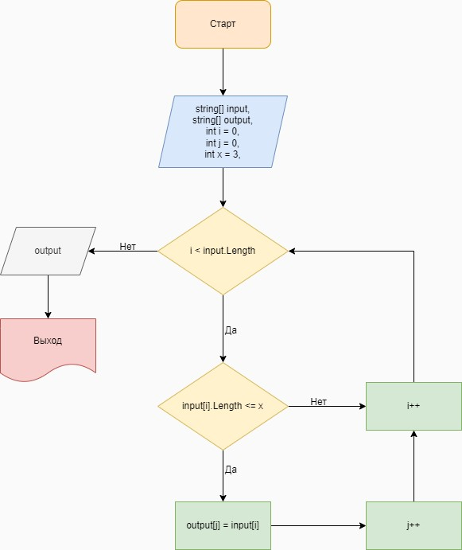

# Итоговая проверечная работа

**Задача:**
*Написать программу, которая из имеющегося массива строк формирует массив из строк, длина которых меньше либо равна 3 символа. Первоначальный массив можно ввести с клавиатуры, либо задать на старте выполнения алгоритма. При решении не рекомендуется пользоваться коллекциями, лучше обойтись исключительно массивами.*

_______

**Алгоритм решения:**

1. Вводим переменные.
2. Ввод элементов начального массива.
3. Производим перебор начального массива.
4. Выбираем элементы,согласно условию задачи, из начального массива в итоговый.
5. вывод массивов.

_______

**Программа**

* Для запуска программы перейдите к файлу "Program.cs"
* Через терминал вводим команду: dotnet run
* Вводим символы через пробел (Например: hello 2 world :-))
* Вывод:
Начальный массив: [hello, 2, world, :-]
Итоговый массив: [2, :-)]
